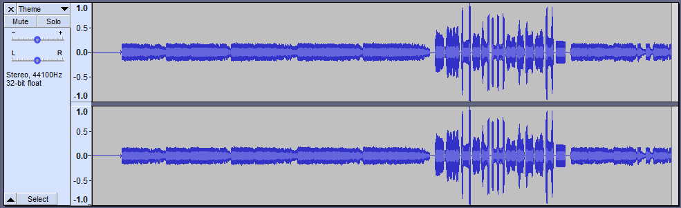
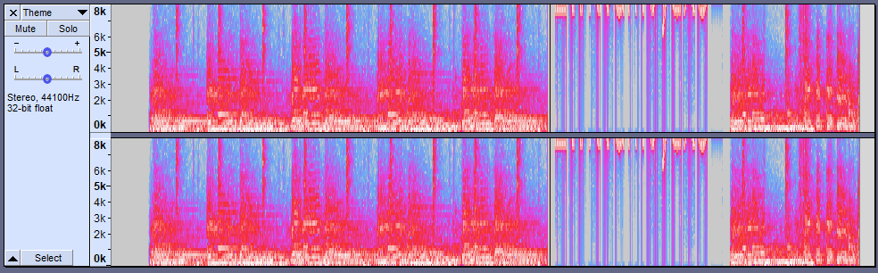
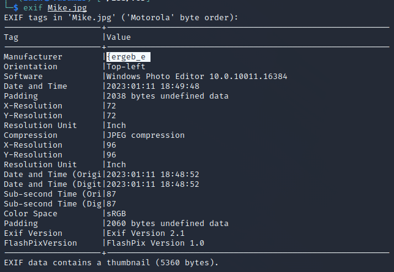

## ISSessions CTF 2023 
# Write-Up - [KPMG] Retro Forensics 

### The challenge

The following file was provided : 

***
### The starting point
This challenge was in the forensics category and we're told that some data has been deleted from a USB storage device. Since we're given an image in place of a physical device, let's start by using [mount](https://man7.org/linux/man-pages/man2/mount.2.html) to see what the visible contents are before we go any further. 

We see a couple of image files which in the context of a CTF puzzle make me think [steganography](https://en.wikipedia.org/wiki/Steganography). But there's also a text file which is undoubtedly a big fat clue from the creator.  

The file **Lots-of-Words** looks an awful lot like a wordlist of passwords, but passwords for what?  

***
### About those deleted files
We could analyze the images on the device, but we were told explicitly that files were deleted, so let's see if we can identify and recover anything. 

[TestDisk](https://www.cgsecurity.org/wiki/TestDisk) is a data recovery utility that will help us do exactly that.

It picks up the Fat16 filesystem and gives us the option to list the contents of the image *including* deleted files. 

Aha, 4 deleted files! We can copy these to our working directory and see what we've got. 

That would be too easy. 

So this is what we have to work with. 

***
### What do you mean part 1? 
As I said earlier, I suspected steganography may be involved, and while there are many ways to hide data inside of another file, we may as well start with the utilities included with kali linux. [Steghide](https://www.kali.org/tools/steghide/) is used to embed and extract hidden data in bmp, jpeg, wav, etc.. but what about something more brute-force. 

#### [StegCracker](https://www.kali.org/tools/stegcracker/) 

Stegcracker allows us to include a wordlist of potential passwords, so I bet that text file we found earlier will come in handy now. 

Sure enough the wordlist contained a valid password to **Saul.jpg**, and the output *looks* like a flag, but it's incomplete. 

#### [StegSeek](https://github.com/RickdeJager/stegseek)

In the stegcracker output above, we see that it has been deprecated in favour of the newer StegSeek, and it never hurts to try multiple tools if you're unsure about the results from one. 

The StegSeek documentation also describes the option to continue scanning a target file after a positive result. So, maybe there was more data hidden in Saul.jpg

StegSeek output the same hidden file, but it also tells us the original filename: flag_**part1**. I guess that means we're not finished. 

The wordlist included with the challenge only worked for Saul.jpg, but StegSeek also claims to be able to use the entire rockyou.txt wordlist in seconds rather than hours. 

[RockYou.txt](https://en.wikipedia.org/wiki/RockYou) is a massive list of real passwords mined from a data breach, so let's throw all of them at **Mike.jpg**

No bueno. Maybe Mike is nothing. 

***
### And now my ears are bleeding
The last recovered file we haven't looked at yet is **Theme.mp3**, and we know that data can be hidden in audio files as well as images, so let's give it a listen. 

It starts out sounding like normal music, then in the middle there's a period of loud high-pitched noise. Not exactly subtle, so this must be something. 

We open the mp3 in the open-source audio app [Audacity](https://www.audacityteam.org/)

The figure above shows a standard waveform, but we can also switch the view to Spectogram, which plots each individual frequency of sound on the x-axis over time, and the color represents the amplitude of the signal.  

There's obviously something fishy going on in the middle, so let's zoom in on just that section. 

Definintely getting somewhere, but we still can't decipher the message. Recall that I mentioned the noise was high-pitched, and on the left hand-side we can see that the scale maxes out at 8 kilohertz. Your audiophile friends may have claimed that they can hear all the way up to 22 kHz, so what if we change the range to something like 5-15 kHz? 

There it is! The equal sign on the end is a giveaway that this is encoded in Base64, so let's just decode the rest of the flag and... 

***
### How it should have gone
So we've established that the flag is divided into three parts and the middle section is almost certainly in **Mike.jpg**

Image files often contain metadata, which can be modified to contain hidden information. There's probably other names for it, but I just know it as exif. 

#### EXIF
Sometimes if I'm feeling lucky, I'll try to install a package in Linux without even checking to see if it exists. 

There is literally\* (\*not literally) a tool for almost everything and if it's something small and straightforward, the tool is probably just named for thing it does. 

Great, let's read the EXIF data from **Mike.jpg**

That's a weird name for a manufacturer, and it's got a curly bracket like a flag, it can't be a coincidence. That's not an english word though so it must be a substitution cipher that only affects letters. Let's throw it in [CyberChef](https://gchq.github.io/CyberChef/) and try the first thing that comes to mind. 

***
### How it actually went

That's a weird name for a manufacturer, but the file size is pretty big for such a small image. And these 4 rows of pixels at the bottom look weird. What if I open it in a hex editor and look for magic numbers? Or I could use binwalk to look for hidden zip files. Didn't we create a hidden volume inside a file with veracrypt? How did I break a dependency in my VM!? The last 3 online stego tools were crap but I bet this one works.   

There's no way that was just a substitution cipher. 

***
### The Flag 
#### retroCTF{retro_recovery}

***
### Lessons Learned
This was definitely a puzzle-style challenge, but that doesn't mean that the effort in solving it was wasted. It may seem like a gimmick, but [steganography](https://www.bbc.com/news/world-asia-china-64206950) was in the news a few days after the CTF. These are some of my takeaways: 
- **Tools and Process**. This might have been my first forensics challenge, so while I'd done some of the steps separately before, this was the first time putting it together and the clues helped me get in the right mindset. 
- **Past experience**. If you think the mp3 section came out of left field, don't feel bad. I had seen a similar challenge once before, and had no clue how to approach it. This time, just that memory was enough to send me down the right search-engine path. 
- **Enjoy the wild goose chase**. All of the false starts I made trying to find the flag hidden in Mike.jpg are just tools in my toolkit for next time. For example, I was familiar with binwalk but had never used it before, and I just doubled my experience with file-carving, which I'm sure will show up in another challenge soon. 
- **Don't make it harder than it has to be**. I've heard cybersecurity veterans say that we're essentially solving the same problems today as we were 20 years ago. The flag hidden in the exif data is just a reminder to check the obvious places first. 

Thanks to [Devin](https://github.com/DevinM17/) for creating the challenge and ISSessions for hosting the event.  
